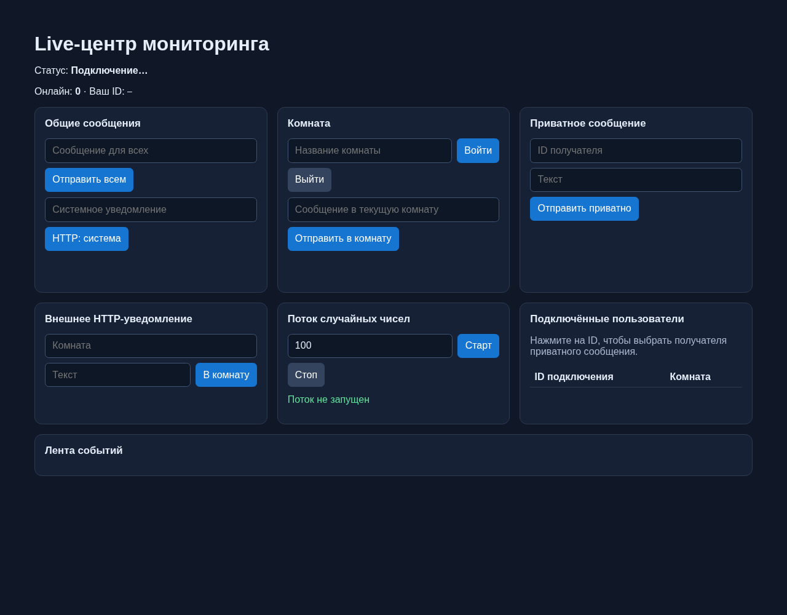
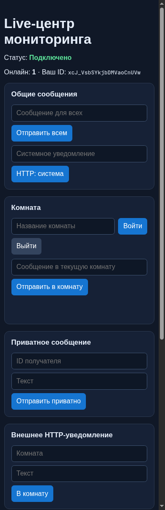

# Практическая работа №8 — Live-центр мониторинга

Веб-панель на ASP.NET Core и SignalR отслеживает подключения пользователей и обменивается событиями без перезагрузки страницы и периодических HTTP-опросов.

## Интерфейс

### Панель на широком экране



### Адаптивное представление



## Запуск

```bash
dotnet run --project LiveMonitor
```

Откройте адрес из консоли в двух или трёх вкладках. По умолчанию профиль запуска использует `http://localhost:5178`.

## Выполнение задания

### Подготовка

- Создан пустой веб-проект ASP.NET Core `LiveMonitor` на .NET 8.
- В `Program.cs` зарегистрирован SignalR через `AddSignalR()`, хаб сопоставлен с `/monitorHub`, включены статические файлы и CORS-политика для локального фронтенда.
- В `Hubs/MonitorHub.cs` создан класс `MonitorHub`, наследующий `Hub`.
- В `wwwroot/index.html` подключён JavaScript-клиент SignalR через CDN и размещён весь интерфейс панели.

### Задание 1 — подключение и широковещание

- `OnConnectedAsync` извещает остальные вкладки событием `UserConnected` и передаёт ID нового подключения.
- `OnDisconnectedAsync` отправляет всем оставшимся клиентам `UserDisconnected`.
- Метод хаба `SendBroadcast` рассылает `ReceiveBroadcast` с ID отправителя и текстом сообщения.
- На странице установлены слушатели трёх событий, а блок «Общие сообщения» позволяет вызвать `SendBroadcast`.

Проверка: откройте две вкладки, затем отправьте сообщение из одной. Обе вкладки сразу получат его в ленте событий. При открытии или закрытии вкладки появится системная запись о подключении или отключении.

### Задание 2 — комнаты

- `JoinRoom` добавляет текущее подключение в SignalR-группу и отправляет вызывающему клиенту `RoomJoined`.
- `LeaveRoom` удаляет подключение из группы и подтверждает операцию событием `RoomLeft`.
- `SendRoomMessage` рассылает `ReceiveRoomMessage` только участникам указанной группы.
- Клиент хранит текущую комнату, а сообщения комнаты в ленте выделяются фиолетовым цветом и пометкой «Комната».

Проверка: в двух вкладках войдите в `alpha`, в третьей — в `beta`. Сообщение из `alpha` увидят только первые две вкладки.

### Задание 3 — состояние подключений и системные сообщения

- Singleton-сервис `ConnectionTracker` хранит потокобезопасный словарь `ID подключения → комната`.
- При подключении, отключении, входе и выходе из комнаты сервис отправляет всем `OnlineCount` и полный список `ActiveUsers`.
- Таблица «Подключённые пользователи» перерисовывается при каждом обновлении; в ней видны ID и текущая комната каждого клиента.
- Метод `SendSystemMessageAsync` отправляет событие `SystemMessage` через `IHubContext<MonitorHub>`.
- Кнопка «HTTP: система» вызывает обычный POST-запрос к `/api/system-message`, после чего сообщение приходит всем клиентам через SignalR.

Проверка: в трёх вкладках счётчик равен 3. Закройте одну — число уменьшится до 2. Нажмите «HTTP: система» в любой вкладке и убедитесь, что системная запись появилась во всех.

### Задание 4 — автоматическое переподключение

- Соединение настроено через `withAutomaticReconnect([0, 2000, 5000, 10000, 30000])`.
- При начале переподключения интерфейс показывает «Переподключение…».
- После успешного восстановления обновляется ID подключения, возвращается статус «Подключено» и повторно вызывается `JoinRoom` для сохранённой комнаты.
- При окончательном закрытии отображается «Соединение потеряно».

Проверка: войдите в `alpha`, включите Offline в DevTools, затем верните сеть. После переподключения клиент снова будет получать сообщения комнаты `alpha`.

### Задание 5 — приватные и внешние уведомления

- Собственный ID подключения отображается в шапке страницы и его можно скопировать.
- `SendPrivateMessage` отправляет `ReceivePrivateMessage` только указанному подключению и подтверждает отправку событием `PrivateMessageSent`.
- ID из таблицы пользователей можно нажать: он подставится в поле получателя приватного сообщения.
- В `Program.cs` добавлены POST-маршруты `/api/room-message` и `/api/private-message`; они используют методы `ConnectionTracker` и `IHubContext`.
- Кнопка «В комнату» в блоке внешнего HTTP-уведомления вызывает `/api/room-message`.

Проверка: скопируйте ID первой вкладки во вторую и отправьте приватное сообщение. Его увидит только первая вкладка. Внешнее уведомление придёт всем участникам заданной комнаты.

## Дополнительные задания

### Лёгкий уровень — «Печатает…»

При вводе сообщения комнаты клиент ждёт 500 мс и вызывает `NotifyTyping`. Хаб отправляет `UserTyping` только остальным участникам комнаты. Получившая вкладка показывает «Пользователь печатает…»; через две секунды без нового события индикатор исчезает.

### Средний уровень — глобальный статус пользователей

`ConnectionTracker` публикует массив объектов `ActiveUser` после каждого изменения состояния. Страница отображает этот массив в таблице и позволяет выбрать пользователя для приватного сообщения одним нажатием на его ID.

### Сложный уровень — потоковая передача данных

`StreamNumbers` возвращает `IAsyncEnumerable<int>` со случайным числом каждые 500 мс. Метод принимает максимум и `CancellationToken`, поэтому поток завершается при отмене подписки или отключении клиента. Кнопки «Старт» и «Стоп» управляют подпиской `connection.stream`, а последние полученные значения выводятся в интерфейсе.

## HTTP API

| Метод и путь | Тело запроса | Результат |
| --- | --- | --- |
| `POST /api/system-message` | `{ "text": "..." }` | Системное сообщение всем клиентам |
| `POST /api/room-message` | `{ "room": "alpha", "text": "..." }` | Сообщение участникам комнаты |
| `POST /api/private-message` | `{ "connectionId": "...", "text": "..." }` | Приватное сообщение выбранному клиенту |
