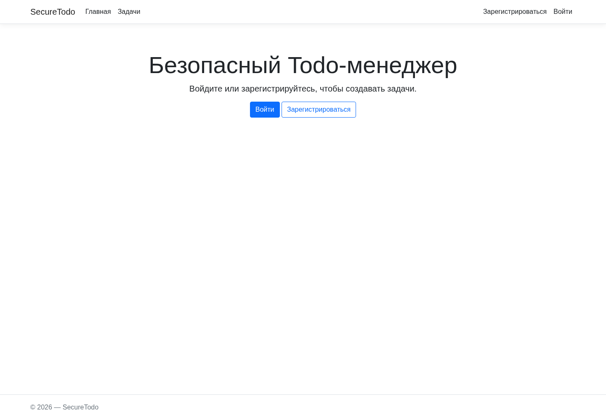
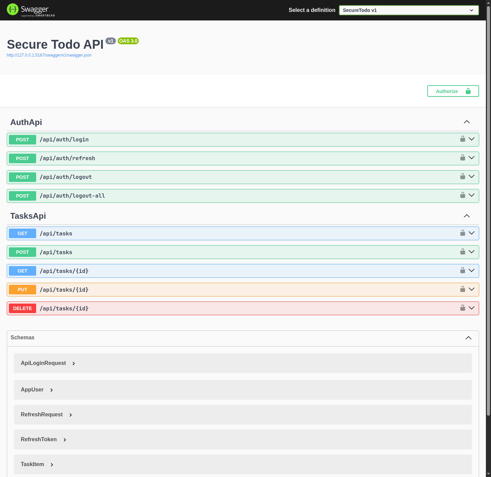
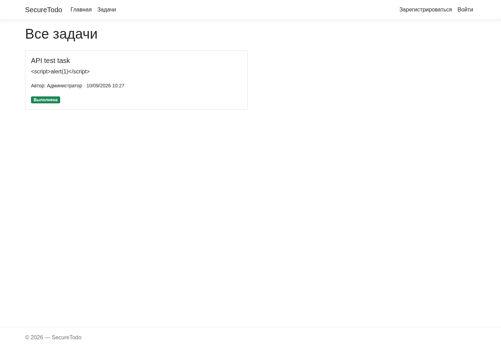

# Отчёт по практической работе «Безопасный Todo-менеджер»

## Результат

Создано приложение `SecureTodo` на .NET 8. Данные Identity, задачи и refresh-токены хранятся
в SQLite. Миграции применяются при старте, роли и администратор создаются идемпотентно.

## Реализация по заданиям

### 1. Identity

- `AppUser : IdentityUser` содержит `FullName`.
- Пароль: минимум 6 символов и обязательная цифра.
- После 5 ошибок аккаунт блокируется на 15 минут.
- Реализованы собственные Razor Pages регистрации, входа и POST-выхода.
- Регистрация автоматически назначает `User` и выполняет вход.

### 2. Роли и защищённые страницы

- При старте создаются `Admin`, `Author`, `User` и `admin@todo.com`.
- `/Tasks/Create` требует входа; `/admin` требует `Admin`.
- Обычный пользователь получает HTTP 403, а анонимный пользователь перенаправляется на login.
- Админ-панель показывает пользователей и роли.

### 3. Resource-based authorization

- `CanEditTaskHandler` разрешает изменение владельцу или администратору.
- Edit/Delete/AJAX сначала загружают ресурс и вызывают `AuthorizeAsync`.
- В списке кнопки изменения выводятся только после такой же проверки.

### 4. JWT API

- API явно использует схему Bearer, Razor Pages — Identity cookie.
- JWT содержит ID, e-mail и роли. Access-токен живёт 15 минут.
- Обычный пользователь получает только свои задачи, Admin — все.
- `UserId` при POST берётся только из claim токена.
- Refresh-токен живёт 7 дней; в БД хранится его SHA-256-хэш. Реализованы ротация,
  `logout` и `logout-all`.

### 5. CSRF и XSS

- На Razor Pages глобально действует `AutoValidateAntiforgeryTokenAttribute`.
- POST-формы используют Form Tag Helper.
- AJAX берёт токен из `<meta name="csrftoken">` и отправляет `X-CSRF-TOKEN`.
- Razor выводит пользовательский текст с HTML-кодированием.
- Заголовки: CSP, `X-Content-Type-Options`, `X-Frame-Options`, `Referrer-Policy`, HSTS.

На скриншоте строка `` отображается как текст, код не выполняется:

### Дополнительные задания

- Админ меняет роли классической POST-формой; снять `Admin` с себя нельзя.
- `SecurityStampValidator` обновляет role claims активной cookie на следующем запросе.
- Настройка 2FA создаёт authenticator key и QR-код `otpauth://`; вход завершается только после TOTP.
- JWT дополнен коротким access-токеном и отзываемыми refresh-токенами.

## Фактические проверки

Проверки выполнены локально на `http://127.0.0.1:5187`:

| Проверка | Результат |
|---|---|
| `dotnet build --no-restore` | 0 ошибок, 0 предупреждений |
| Пароль из 3 символов | HTTP 200 с серверной ошибкой валидации |
| Пятая ошибка пароля | `LockoutEnd` установлен; верный пароль возвращает 401 |
| Анонимный `/Tasks/Create` | 302 на `/Account/Login` |
| Пользователь открывает `/admin` | 403 |
| Пользователь открывает чужой `/Tasks/Edit/1` | 403 |
| Роль User → Author | `/author` стал доступен на той же cookie, HTTP 200 |
| Снять Admin с себя | действие отклонено, роль осталась Admin |
| `GET /api/tasks` без JWT | 401 |
| JWT login / create / list | 200 / 201 / 200 |
| `UserId` созданной задачи | взят из JWT claim |
| Ротация refresh-токена | новая пара выдана; старый refresh получил 401 |
| `logout-all` | 204, активные refresh-токены отозваны |
| AJAX без `X-CSRF-TOKEN` | 400 |
| AJAX с токеном | 200, задача отмечена выполненной |
| XSS-строка | выведена как `&lt;script&gt;...`, скрипт не запущен |
| Security headers | все требуемые заголовки присутствуют |
| 2FA | QR создан; password → TFA redirect; верный TOTP → вход |

После проверки временные пользователи, задачи и токены удалены из учебной базы; оставлен только
идемпотентный seed-администратор.
