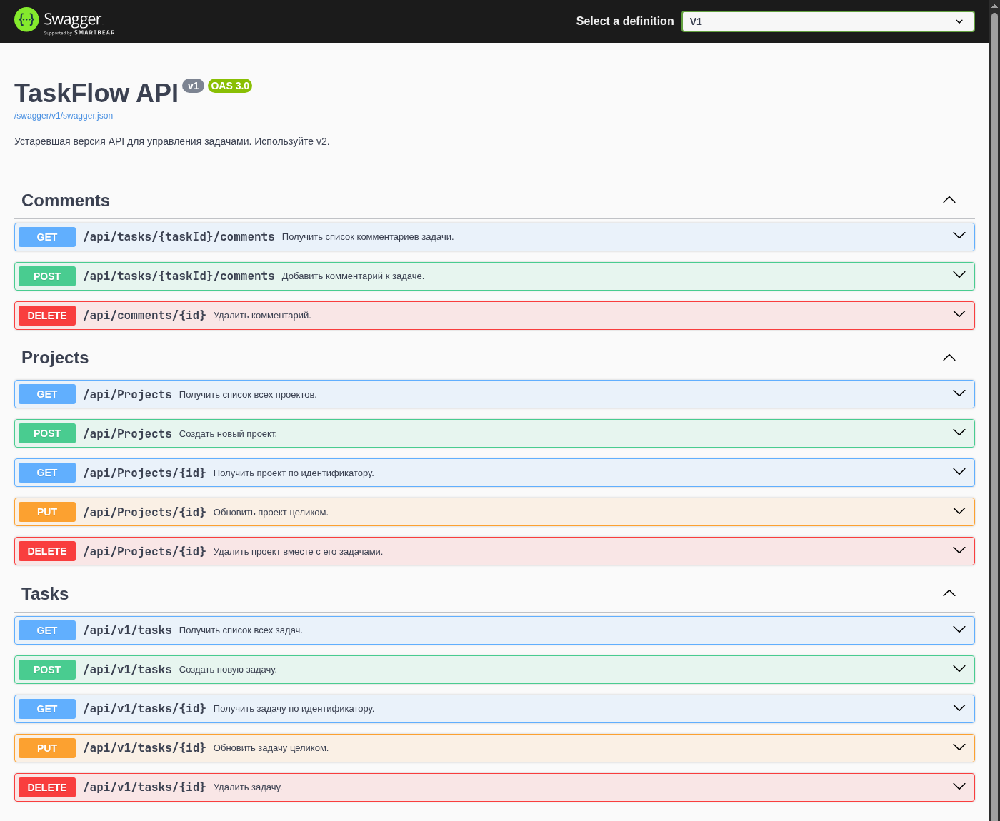
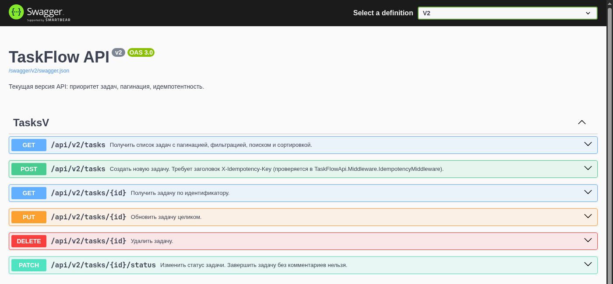
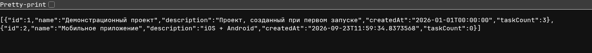
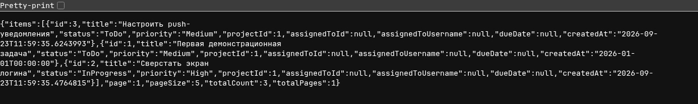
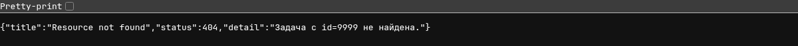

# TaskFlow API

REST API для управления задачами (аналог Trello/Jira в миниатюре).
Стек: **ASP.NET Core 8**, **EF Core + SQLite**, **Swagger**, `.http`-файлы.

Практическая работа выполнена полностью, по всем трём уровням сложности.

## Запуск

```bash
cd TaskFlowApi
dotnet run
```

При первом запуске автоматически применяются миграции EF Core и создаётся `taskflow.db`
с seed-данными (один проект и одна задача). Swagger UI: `http://localhost:5299/swagger`.
Все проверочные запросы собраны в `TaskFlowApi.http`.

---

## Уровень 1 — Базовый CRUD и REST

- Создан проект `TaskFlowApi`, подключён Swagger с чтением XML-комментариев
  (`GenerateDocumentationFile` в `.csproj`, `IncludeXmlComments` в `Program.cs`).
- Созданы Entity-классы `Project`, `TaskItem`, `AppUser`, `Comment`.
- `ProjectsController` и `TasksController` — полный CRUD (`[ApiController]`,
  `ActionResult<T>`, `201 Created` с `Location`, `404 NotFound`, `[ProducesResponseType]`
  на каждый метод, XML-`<summary>` для Swagger).
- Задача имеет `Status` (`ToDo` / `InProgress` / `Done`): при `POST` без статуса —
  `ToDo` по умолчанию, при `PUT` статус обязателен.
- Валидация через Data Annotations (`[Required]`, `[StringLength]`, кастомный
  `[FutureDate]` для `DueDate`) — автоматически даёт `400` с `ValidationProblemDetails`.

**Проверено:** пустое имя проекта → `400` с `errors.Name`.



---

## Уровень 2 — DTO, EF Core, связи, версионирование

- Подключён EF Core + SQLite (`AppDbContext`, миграция `Init`, `Database.Migrate()`
  при старте). В `OnModelCreating`: связь `Project → TaskItem` с каскадным удалением,
  индекс по `TaskItem.Status`, seed-данные (проект + задача).
- Entity и DTO разделены (`ProjectDto`, `CreateProjectDto`, `TaskItemDto`,
  `CreateTaskDto`, `CommentDto` и т.д.), маппинг — ручные extension-методы
  (`Mapping/MappingExtensions.cs`). `AppUser.PasswordHash` никогда не отдаётся наружу.
  `ProjectDto.TaskCount` вычисляется на лету.
- `CommentsController` — вложенный ресурс `/api/tasks/{taskId}/comments`,
  404 у несуществующей задачи, каскадное удаление комментариев вместе с задачей.
- Версионирование через `Asp.Versioning` (URL-сегмент): `TasksController` (v1,
  `Deprecated = true`, содержит `Description`) и `TasksV2Controller` (v2, содержит
  `Priority` вместо `Description`). Обе версии видны в Swagger UI.

**Проверено:** `GET /api/v1/tasks/1` содержит `description`, не содержит `priority`;
`GET /api/v2/tasks/1` — наоборот.





---

## Уровень 3 — Идемпотентность, пагинация, глобальная обработка ошибок

- `GET /api/v2/tasks` — пагинация (`Skip`/`Take`), фильтр по `status`/`priority`,
  поиск по `search`, сортировка через `switch` по `sortBy`/`sortDir`, `pageSize > 50`
  → `400`. Ответ — `PagedResult<TaskItemV2Dto>`.
- `POST /api/v2/tasks` защищён `IdempotencyMiddleware`: обязательный заголовок
  `X-Idempotency-Key`, запись `(key, hash, response)` хранится в таблице
  `IdempotencyRecords`. Повтор с тем же ключом и телом → тот же сохранённый ответ;
  тот же ключ с другим телом → `409 Conflict`; без ключа → `400`.
- Глобальная обработка ошибок через `GlobalExceptionHandler : IExceptionHandler`:
  `NotFoundException` → `404`, `BusinessRuleException` → `422`
  (нельзя завершить задачу без комментариев, `PATCH /api/v2/tasks/{id}/status`),
  любое другое исключение → `500` без stack trace и деталей.
- CORS настроен для `http://localhost:3000`, `UseCors()` — после `UseRouting()`,
  до `UseAuthorization()`.

**Проверено:** запрос к несуществующей задаче → `404 ProblemDetails`.





Пример идемпотентного запроса (из `TaskFlowApi.http`):

```http
POST /api/v2/tasks
X-Idempotency-Key: 550e8400-e29b-41d4-a716-446655440000
Content-Type: application/json

{ "title": "Новая задача", "priority": "High", "projectId": 1 }
```

Повтор того же запроса возвращает тот же `201` и ту же задачу; тот же ключ
с другим телом — `409 Conflict`; без заголовка — `400`.

---

## Структура проекта

```
TaskFlowApi/
├── Controllers/        ProjectsController, TasksController (v1), TasksV2Controller (v2), CommentsController
├── DTOs/                Project/Task/Comment DTO + PagedResult<T>
├── Data/                 AppDbContext (связи, seed data)
├── Entities/             Project, TaskItem, AppUser, Comment, IdempotencyRecord
├── Exceptions/           NotFoundException, BusinessRuleException, GlobalExceptionHandler
├── Middleware/           IdempotencyMiddleware
├── Mapping/              MappingExtensions (ручной маппинг Entity → DTO)
├── Validation/           FutureDateAttribute
├── Migrations/           миграция EF Core Init
├── Program.cs
├── TaskFlowApi.http     ← все проверочные запросы из задания
└── taskflow.db          ← создаётся автоматически при запуске (не в репозитории)
```
